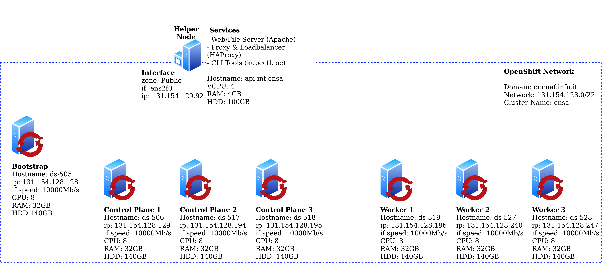

# OpenShift 4.7 Bare Metal Install - User Provisioned Infrastructure (UPI)

- [OpenShift 4.7 Bare Metal Install - User Provisioned Infrastructure (UPI)](#openshift-4.7-bare-metal-install---user-provisioned-infrastructure-upi)
  - [Architecture Diagram](#architecture-diagram)
  - [Download Software](#download-software)
  - [Prepare the 'Bare Metal' environment](#prepare-the-bare-metal-environment)
  - [Configure Environmental Services](#configure-environmental-services)
  - [Generate and host install files](#generate-and-host-install-files)
  - [Deploy OpenShift](#deploy-openshift)
  - [Monitor the Bootstrap Process](#monitor-the-bootstrap-process)
  - [Remove the Bootstrap Node](#remove-the-bootstrap-node)
  - [Wait for installation to complete](#wait-for-installation-to-complete)
  - [Join Worker Nodes](#join-worker-nodes)
  - [Configure storage for the Image Registry](#configure-storage-for-the-image-registry)
  - [Create the first Admin user](#create-the-first-admin-user)
  - [Access the OpenShift Console](#access-the-openshift-console)
  - [Troubleshooting](#troubleshooting)

## Architecture Diagram



## Download Software

1. Download [CentOS 8 x86_64 image](https://www.centos.org/centos-linux/)
1. Login to [RedHat OpenShift Cluster Manager](https://cloud.redhat.com/openshift)
1. Select 'Create Cluster' from the 'Clusters' navigation menu
1. Select 'RedHat OpenShift Container Platform'
1. Select 'Run on Bare Metal'
1. Download the following files:

   - Openshift Installer for Linux
   - Pull secret
   - Command Line Interface for Linux and your workstations OS
   - Red Hat Enterprise Linux CoreOS (RHCOS)
     - rhcos-metal.x86_64.raw.gz
     - rhcos-live.x86_64.iso

## Prepare the 'Bare Metal' environment

1. Take 3 Control Plane bare-metal machines with minimum settings:
   - Name: ds-5XX
   - 8cpu
   - 32GB RAM
   - 140GB HDD
   - NIC connected to the OCP network
   - Load the rhcos-live.x86_64.iso image into the CD/DVD drive via IPMI console
1. Take 3 Worker bare-metal machines (or more if you want) with minimum settings:
   - Name: ds-5XX
   - 8cpu
   - 32GB RAM
   - 140GB HDD
   - NIC connected to the OCP network
   - Load the rhcos-live.x86_64.iso image into the CD/DVD drive via IPMI console
1. Take a Bootstrap bare-metal machine (this machine will be reinstalled once installation completes) with minimum settings:
   - Name: ds-505
   - 8cpu
   - 32GB RAM
   - 140GB HDD
   - NIC connected to the OCP network
   - Load the rhcos-live.x86_64.iso image into the CD/DVD drive via IPMI console
1. Create a Services virtual machine with minimum settings:
   - Name: api-int.cnsa
   - 4vcpu
   - 4GB RAM
   - 100GB HDD
   - NIC connected to the OCP network
   - Load the CentOS_8.iso image into the CD/DVD drive
1. Boot the Services virtual machine

## Configure Environmental Services

1. Install CentOS8 on the api-int.cnsa host

1. Boot the api-int.cnsa VM

1. Move the files downloaded from the RedHat Cluster Manager site to the api-int.cnsa node

   ```bash
   scp ~/Downloads/openshift-install-linux.tar.gz ~/Downloads/openshift-client-linux.tar.gz ~/Downloads/rhcos-x.x.x-x86_64-installer.x86_64.iso root@{api-int_IP_address}:/root/
   ```

1. SSH to the api-int.cnsa vm

   ```bash
   ssh root@{api-int_IP_address}
   ```

1. Extract Client tools and copy them to `/usr/local/bin`

   ```bash
   tar xvf openshift-client-linux.tar.gz
   mv oc kubectl /usr/local/bin
   ```

1. Confirm Client Tools are working

   ```bash
   kubectl version
   oc version
   ```

1. Extract the OpenShift Installer

   ```bash
   tar xvf openshift-install-linux.tar.gz
   ```

1. Update CentOS so we get the latest packages for each of the services we are about to install

   ```bash
   dnf update
   ```

1. Install Git

   ```bash
   dnf install git -y
   ```

1. Download [config files](https://baltig.infn.it/fornari/openshift-bare-metal.git) for each of the services

   ```bash
   git clone https://baltig.infn.it/fornari/openshift-bare-metal.git
   ```

1. OPTIONAL: Create a file '~/.vimrc' and paste the following (this helps with editing in vim, particularly yaml files):

   ```bash
   cat <<EOT >> ~/.vimrc
   syntax on
   set nu et ai sts=0 ts=2 sw=2 list hls
   EOT
   ```

   Update the preferred editor

   ```bash
   export OC_EDITOR="vim"
   export KUBE_EDITOR="vim"
   ```

1. Install bind-utils

   ```bash
   dnf install bind bind-utils -y
   ```

1. Add entries to DNS for direct and reverse Openshift nodes resolving:
   
   ```bash
   cat db.cr.cnaf.infn.it

   ; Temp Bootstrap Node
   bootstrap.cnsa.cr.cnaf.infn.it.       IN      A      131.154.128.128

   ; Control Plane Nodes
   master0.cnsa.cr.cnaf.infn.it.         IN      A      131.154.128.129
   master1.cnsa.cr.cnaf.infn.it.         IN      A      131.154.128.194
   master2.cnsa.cr.cnaf.infn.it.         IN      A      131.154.128.195

   ; Worker Nodes
   worker0.cnsa.cr.cnaf.infn.it.        IN      A      131.154.128.196
   worker1.cnsa.cr.cnaf.infn.it.        IN      A      131.154.128.240
   worker2.cnsa.cr.cnaf.infn.it.        IN      A      131.154.128.247

   ; OpenShift Internal - Load balancer
   api.cnsa.cr.cnaf.infn.it.        IN    A    131.154.129.92
   api-int.cnsa.cr.cnaf.infn.it.    IN    A    131.154.129.92
   *.apps.cnsa.cr.cnaf.infn.it.     IN    A    131.154.129.92

   cat db.reverse

   92      IN    PTR    api.cnsa.cr.cnaf.infn.it.
   92      IN    PTR    api-int.cnsa.cr.cnaf.infn.it.
   ;
   128    IN    PTR    bootstrap.cnsa.cr.cnaf.infn.it.
   ;
   129    IN    PTR    master0.cnsa.cr.cnaf.infn.it.
   194    IN    PTR    master1.cnsa.cr.cnaf.infn.it.
   195    IN    PTR    master2.cnsa.cr.cnaf.infn.it.
   ;
   196    IN    PTR    worker0.cnsa.cr.cnaf.infn.it.
   240    IN    PTR    worker1.cnsa.cr.cnaf.infn.it.
   247    IN    PTR    worker2.cnsa.cr.cnaf.infn.it.
   ```

1. Install & configure Apache Web Server

   Install Apache

   ```bash
   dnf install httpd -y
   ```

   Change default listen port to 8080 in httpd.conf

   ```bash
   sed -i 's/Listen 80/Listen 0.0.0.0:8080/' /etc/httpd/conf/httpd.conf
   ```

   Configure the firewall for Web Server traffic

   ```bash
   firewall-cmd --add-port=8080/tcp --zone=public --permanent
   firewall-cmd --reload
   ```

   Enable and start the service

   ```bash
   systemctl enable httpd
   systemctl start httpd
   systemctl status httpd
   ```

   Making a GET request to localhost on port 8080 should now return the default Apache webpage

   ```bash
   curl localhost:8080
   ```

1. Install & configure HAProxy

   Install HAProxy

   ```bash
   dnf install haproxy -y
   ```

   Copy HAProxy config

   ```bash
   cp ~/openshift-bare-metal/haproxy.cfg /etc/haproxy/haproxy.cfg
   ```

   Configure the Firewall

   > Note: Opening port 9000 in the external zone allows access to HAProxy stats that are useful for monitoring and troubleshooting. The UI can be accessed at: `http://{api-int_IP_address}:9000/stats`

   ```bash
   firewall-cmd --add-port=6443/tcp --zone=public --permanent # kube-api-server on control plane nodes
   firewall-cmd --add-port=22623/tcp --zone=public --permanent # machine-config server
   firewall-cmd --add-service=http --zone=public --permanent # web services hosted on worker nodes
   firewall-cmd --add-service=https --zone=public --permanent # web services hosted on worker nodes
   firewall-cmd --add-port=9000/tcp --zone=public --permanent # HAProxy Stats
   firewall-cmd --reload
   ```

   Enable and start the service

   ```bash
   setsebool -P haproxy_connect_any 1 # SELinux name_bind access
   systemctl enable haproxy
   systemctl start haproxy
   systemctl status haproxy
   ```
## Generate and host install files

1. Generate an SSH key pair keeping all default options

   ```bash
   ssh-keygen
   ```

1. Create an install directory

   ```bash
   mkdir ~/ocp-install
   ```

1. Copy the install-config.yaml included in the clones repository to the install directory

   ```bash
   cp ~/openshift-bare-metal/install-config.yaml ~/ocp-install
   ```

1. Update the install-config.yaml with your own pull-secret and ssh key.

   - Line 23 should contain the contents of your pull-secret.txt
   - Line 24 should contain the contents of your '~/.ssh/id_rsa.pub'

   ```bash
   vim ~/ocp-install/install-config.yaml
   ```

1. Generate Kubernetes manifest files

   ```bash
   ~/openshift-install create manifests --dir ~/ocp-install
   ```

   > A warning is shown about making the control plane nodes schedulable. It is up to you if you want to run workloads on the Control Plane nodes. If you dont want to you can disable this with:
   > `sed -i 's/mastersSchedulable: true/mastersSchedulable: false/' ~/ocp-install/manifests/cluster-scheduler-02-config.yml`.
   > Make any other custom changes you like to the core Kubernetes manifest files.

   Generate the Ignition config and Kubernetes auth files

   ```bash
   ~/openshift-install create ignition-configs --dir ~/ocp-install/
   ```

1. Create a hosting directory to serve the configuration files for the OpenShift booting process

   ```bash
   mkdir /var/www/html/ocp4
   ```

1. Copy all generated install files to the new web server directory

   ```bash
   cp -R ~/ocp-install/* /var/www/html/ocp4
   ```

1. Move the Core OS image to the web server directory (later you need to type this path multiple times so it is a good idea to shorten the name)

   ```bash
   mv ~/rhcos-metal.x86_64.raw.gz /var/www/html/ocp4/rhcos
   ```

1. Change ownership and permissions of the web server directory

   ```bash
   chcon -R -t httpd_sys_content_t /var/www/html/ocp4/
   chown -R apache: /var/www/html/ocp4/
   chmod 755 /var/www/html/ocp4/
   ```

1. Confirm you can see all files added to the `/var/www/html/ocp4/` dir through Apache

   ```bash
   curl localhost:8080/ocp4/
   ```

## Deploy OpenShift

1. Power on the bootstrap host and Control Plane hosts and select 'Tab' to enter boot configuration. Enter the following configuration:

   ```bash
   # Bootstrap Node - bootstrap.cnsa
   coreos.inst.install_dev=sdb coreos.inst.image_url=http://131.154.129.92:8080/ocp4/rhcos coreos.inst.insecure=yes coreos.inst.ignition_url=http://131.154.129.92:8080/ocp4/bootstrap.ign
   ```

   ```bash
   # Each of the Control Plane Nodes - master\#.cnsa
   coreos.inst.install_dev=sdb coreos.inst.image_url=http://131.154.129.92:8080/ocp4/rhcos coreos.inst.insecure=yes coreos.inst.ignition_url=http://131.154.129.92:8080/ocp4/master.ign
   ```

1. Power on the worker\#.cnsa hosts and select 'Tab' to enter boot configuration. Enter the following configuration:

   ```bash
   # Each of the Worker Nodes - worker\#.cnsa
   coreos.inst.install_dev=sdb coreos.inst.image_url=http://131.154.129.92:8080/ocp4/rhcos coreos.inst.insecure=yes coreos.inst.ignition_url=http://131.154.129.92:8080/ocp4/worker.ign
   ```

1. When installation is completed, nodes will be automatically rebooted. Before reboot is completed, enter BIOS console and enable EFI Optimized Boot. Save configuration and exit in order for CoreOS to automatically boot on machine restart.

## Monitor the Bootstrap Process

1. You can monitor the bootstrap process from the api-int.cnsa host at different log levels (debug, error, info)

   ```bash
   ~/openshift-install --dir ~/ocp-install wait-for bootstrap-complete --log-level=debug
   ```

1. Once bootstrapping is complete the boostrap.cnsa node [can be removed](#remove-the-bootstrap-node)

## Remove the Bootstrap Node

1. Remove all references to the `bootstrap.cnsa` host from the `/etc/haproxy/haproxy.cfg` file

   ```bash
   # Two entries
   vim /etc/haproxy/haproxy.cfg
   # Restart HAProxy - If you are still watching HAProxy stats console you will see that the boostrap.cnsa host has been removed from the backends.
   systemctl reload haproxy
   ```

1. The bootstrap.cnsa host can now be safely shutdown and deleted or reinstalled

## Wait for installation to complete

> IMPORTANT: if you set mastersSchedulable to false the [worker nodes will need to be joined to the cluster](#join-worker-nodes) to complete the installation. This is because the OpenShift Router will need to be scheduled on the worker nodes and it is a dependency for cluster operators such as ingress, console and authentication.

1. Collect the OpenShift Console address and kubeadmin credentials from the output of the install-complete event

   ```bash
   ~/openshift-install --dir ~/ocp-install wait-for install-complete
   ```

1. Continue to join the worker nodes to the cluster in a new tab whilst waiting for the above command to complete

## Join Worker Nodes

1. Setup 'oc' and 'kubectl' clients on the api-int.cnsa machine

   ```bash
   export KUBECONFIG=~/ocp-install/auth/kubeconfig
   # Test auth by viewing cluster nodes
   oc get nodes
   ```

1. View and approve pending CSRs

   > Note: Once you approve the first set of CSRs additional 'kubelet-serving' CSRs will be created. These must be approved too.
   > If you do not see pending requests wait until you do.

   ```bash
   # View CSRs
   oc get csr
   # Approve all pending CSRs
   oc get csr -o go-template='{{range .items}}{{if not .status}}{{.metadata.name}}{{"\n"}}{{end}}{{end}}' | xargs oc adm certificate approve
   # Wait for kubelet-serving CSRs and approve them too with the same command
   oc get csr -o go-template='{{range .items}}{{if not .status}}{{.metadata.name}}{{"\n"}}{{end}}{{end}}' | xargs oc adm certificate approve
   ```

1. Watch and wait for the Worker Nodes to join the cluster and enter a 'Ready' status

   > This can take 5-10 minutes

   ```bash
   watch -n5 oc get nodes
   ```

## Configure storage for the Image Registry

> A Bare Metal cluster does not by default provide storage so the Image Registry Operator bootstraps itself as 'Removed' so the installer can complete. As the installation has now completed storage can be added for the Registry and the operator updated to a 'Managed' state.

1. Create the 'image-registry-storage' PVC by updating the Image Registry operator config by updating the management state to 'Managed' and adding 'pvc' and 'claim' keys in the storage key:

   ```bash
   oc edit configs.imageregistry.operator.openshift.io
   ```

   ```yaml
   managementState: Managed
   ```

   ```yaml
   storage:
     pvc:
       claim: # leave the claim blank
   ```

1. Confirm the 'image-registry-storage' pvc has been created and is currently in a 'Pending' state

   ```bash
   oc get pvc -n openshift-image-registry
   ```

1. Deploy CephFS secret, storage class and persistent volume provisioner:

   ```bash
   oc create -f ~/openshift-bare-metal/manifest/cephfs-secret.yml 
   oc create -f ~/openshift-bare-metal/manifest/cephfs-sc.yml 
   oc create -f ~/openshift-bare-metal/manifest/cephfs-provisioner.yml 
   ```

1. Delete the 'image-registry-storage' pvc 

   ```bash
   oc delete pvc image-registry-storage -n openshift-image-registry
   ```

1. Create the CephFS persistent volume claim for the 'image-registry-storage' pvc

   ```bash
   oc create -f ~/openshift-bare-metal/manifest/registry-pvc.yaml
   ```

1. After a short wait the 'image-registry-storage' pvc should now be bound

   ```bash
   oc get pvc -n openshift-image-registry
   ```

## Create the first Admin user

1. Apply the `oauth-htpasswd.yaml` file to the cluster

   > This will create a user 'admin' with the password 'password'. To set a different username and password substitue the htpasswd key in the '~/openshift-bare-metal/manifest/oauth-htpasswd.yaml' file with the output of `htpasswd -n -B -b <username> <password>`

   ```bash
   oc apply -f ~/openshift-bare-metal/manifest/oauth-htpasswd.yaml
   ```

1. Assign the new user (admin) admin permissions

   ```bash
   oc adm policy add-cluster-role-to-user cluster-admin admin
   ```

## Access the OpenShift Console

1. Wait for the 'console' Cluster Operator to become available

   ```bash
   oc get co
   ```

1. Navigate to the [OpenShift Console URL](https://console-openshift-console.apps.cnsa.cr.cnaf.infn.it) and log in as the 'admin' user

   > You will get self signed certificate warnings that you can ignore
   > If you need to login as kubeadmin and need to the password again you can retrieve it with: `cat ~/ocp-install/auth/kubeadmin-password`

## Troubleshooting

1. You can collect logs from all cluster hosts by running the following command from the 'api-int.cnsa' host:

   ```bash
   ./openshift-install gather bootstrap --dir ocp-install --bootstrap=131.154.128.128 --master=131.154.128.129 --master=131.154.128.194 --master=131.154.128.195
   ```

1. Modify the role of the Control Plane Nodes

   If you would like to schedule workloads on the Control Plane nodes apply the 'worker' role by changing the value of 'mastersSchedulable' to true.

   If you do not want to schedule workloads on the Control Plane nodes remove the 'worker' role by changing the value of 'mastersSchedulable' to false.

   > Remember depending on where you host your workloads you will have to update HAProxy to include or exclude the control plane nodes from the ingress backends.

   ```bash
   oc edit schedulers.config.openshift.io cluster
   ```
